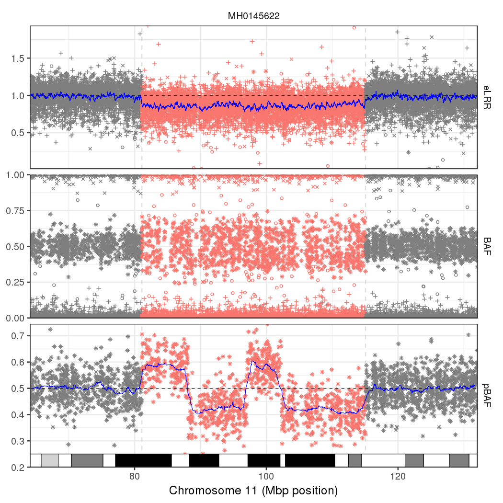
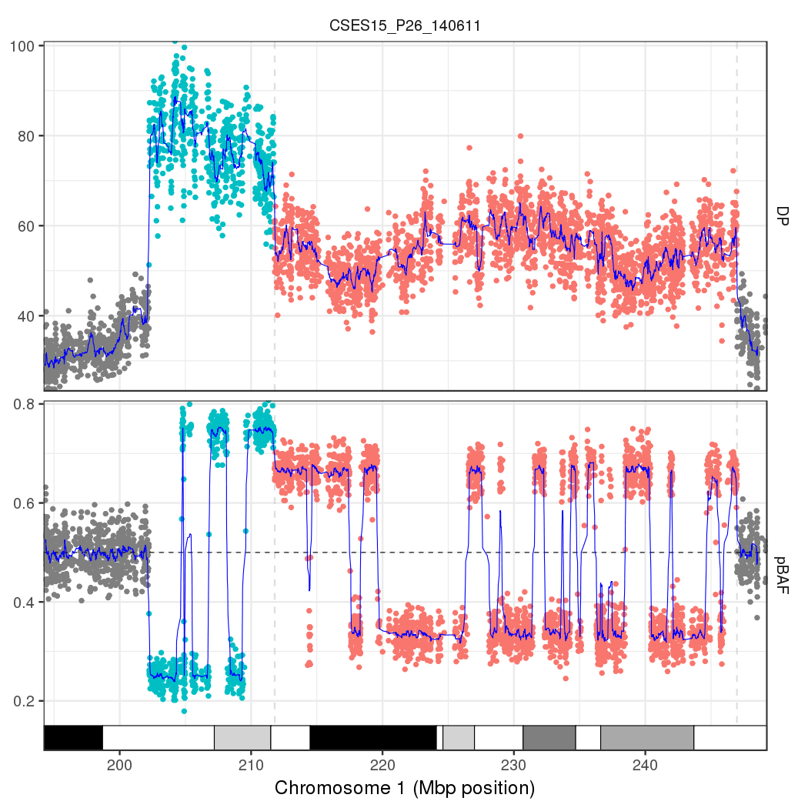

A BCFtools extension to call mosaic chromosomal alterations starting from phased VCF files with either B Allele Frequency (BAF) and Log R Ratio (LRR) or allelic depth (AD). If you use this tool in your publication, please cite the following papers from [2018](https://doi.org/10.1038/s41586-018-0321-x) and [2020](https://doi.org/10.1038/s41586-020-2430-6)
```
Loh P., Genovese G., McCarroll S., Price A. et al. Insights about clonal expansions from 8,342 mosaic
chromosomal alterations. Nature 559, 350–355 (2018). [PMID: 29995854] [DOI: 10.1038/s41586-018-0321-x]

Loh P., Genovese G., McCarroll S., Monogenic and polygenic inheritance become
instruments for clonal selection (2020). [PMID: 32581363] [DOI: 10.1038/s41586-020-2430-6]
```
and this website. For any feedback or questions, contact the [author](mailto:giulio.genovese@gmail.com)

WARNING: MoChA will not yield useful results for VCFs from whole exome sequencing data as MoChA does not model the reference allele bias in these assays. Furthermore, whole exome sequencing does not include enough heterozygous sites to allow for detection of mosaic chromosomal alterations at low cell fractions. Similarly, low coverage whole genome sequencing will not provide a sufficient sampling of molecules to detect mosaic chromosomal alterations at low cell fractions, even in the unlikely ideal scenario of most heterozygous sites correctly genotyped and phased

<!--ts-->
   * [Usage](#usage)
   * [Installation](#installation)
   * [Download resources for GRCh37](#download-resources-for-grch37)
   * [Download resources for GRCh38](#download-resources-for-grch38)
   * [Prepare data](#prepare-data)
   * [Phase genotypes](#phase-genotypes)
   * [Call chromosomal alterations](#call-chromosomal-alterations)
   * [Filter callset](#filter-callset)
   * [Generate mosaic phenotypes](#generate-mosaic-phenotypes)
   * [Compute allelic shift](#compute-allelic-shift)
   * [Plot results](#plot-results)
   * [HMM parameters](#hmm-parameters)
   * [Acknowledgements](#acknowledgements)
<!--te-->

Usage
=====

A set of [WDL](https://github.com/freeseek/mochawdl) pipelines are available to run the entire MoChA pipeline from raw intensity files to final calls and imputed VCFs

```
Usage:   bcftools +mocha [OPTIONS] <in.vcf.gz>

Required options:
    -g, --genome <assembly>[?]      predefined genome reference rules, 'list' to print available settings, append '?' for details
    -G, --genome-file <file>        genome reference rules, space/tab-delimited CHROM:FROM-TO,TYPE

General Options:
    -v, --variants [^]<file>        tabix-indexed [compressed] VCF/BCF file containing variants
    -f, --apply-filters <list>      require at least one of the listed FILTER strings (e.g. "PASS,.")
                                    to include (or exclude with "^" prefix) in the analysis
    -e, --exclude <expr>            exclude sites for which the expression is true
    -i, --include <expr>            select sites for which the expression is true
    -r, --regions <region>          restrict to comma-separated list of regions
    -R, --regions-file <file>       restrict to regions listed in a file
        --regions-overlap 0|1|2     Include if POS in the region (0), record overlaps (1), variant overlaps (2) [1]
    -t, --targets [^]<region>       restrict to comma-separated list of regions. Exclude regions with "^" prefix
    -T, --targets-file [^]<file>    restrict to regions listed in a file. Exclude regions with "^" prefix
        --targets-overlap 0|1|2     Include if POS in the region (0), record overlaps (1), variant overlaps (2) [0]
    -s, --samples [^]<list>         comma separated list of samples to include (or exclude with "^" prefix)
    -S, --samples-file [^]<file>    file of samples to include (or exclude with "^" prefix)
        --force-samples             only warn about unknown subset samples
        --input-stats <file>        input samples genome-wide statistics file
        --only-stats                compute genome-wide statistics without detecting mosaic chromosomal alterations
    -p  --cnp <file>                list of regions to genotype in BED format
        --mhc <region>              MHC region to exclude from analysis (will be retained in the output)
        --kir <region>              KIR region to exclude from analysis (will be retained in the output)
        --threads <int>             number of extra output compression threads [0]

Output Options:
    -o, --output <file>             write output to a file [no output]
    -O, --output-type u|b|v|z[0-9]  u/b: un/compressed BCF, v/z: un/compressed VCF, 0-9: compression level [v]
        --no-version                do not append version and command line to the header
    -a  --no-annotations            omit Ldev and Bdev FORMAT from output VCF (requires --output)
        --no-log                    suppress progress report on standard error
    -l  --log <file>                write log to file [standard error]
    -c, --calls <file>              write chromosomal alterations calls table to a file [standard output]
    -z  --stats <file>              write samples genome-wide statistics table to a file [no output]
    -u, --ucsc-bed <file>           write UCSC bed track to a file [no output]
    -W, --write-index[=FMT]         Automatically index the output files [off]

HMM Options:
        --bdev-LRR-BAF <list>       comma separated list of inverse BAF deviations for LRR+BAF model [-2.0,-4.0,-6.0,10.0,6.0,4.0]
        --bdev-BAF-phase <list>     comma separated list of inverse BAF deviations for BAF+phase model
                                    [6.0,8.0,10.0,15.0,20.0,30.0,50.0,80.0,130.0,210.0,340.0,550.0]
        --min-dist <int>            minimum base pair distance between consecutive sites for WGS data [400]
        --adjust-BAF-LRR <int>      minimum number of genotypes for a cluster to median adjust BAF and LRR (-1 for no adjustment) [5]
        --regress-BAF-LRR <int>     minimum number of genotypes for a cluster to regress BAF against LRR (-1 for no regression) [15]
        --LRR-GC-order <int>        order of polynomial to regress LRR against local GC content (-1 for no regression) [2]
        --xy-major-pl               major transition phred-scaled likelihood [65.0]
        --xy-minor-pl               minor transition phred-scaled likelihood [35.0]
        --auto-tel-pl               autosomal telomeres phred-scaled likelihood [20.0]
        --chrX-tel-pl               chromosome X telomeres phred-scaled likelihood [8.0]
        --chrY-tel-pl               chromosome Y telomeres phred-scaled likelihood [6.0]
        --error-pl                  uniform error phred-scaled likelihood [15.0]
        --flip-pl                   phase flip phred-scaled likelihood [20.0]
        --short-arm-chrs <list>     list of chromosomes with short arms [13,14,15,21,22,chr13,chr14,chr15,chr21,chr22]
        --use-short-arms            use variants in short arms [FALSE]
        --use-centromeres           use variants in centromeres [FALSE]
        --use-males-xtr             use variants in XTR region for males [FALSE]
        --use-males-par2            use variants in PAR2 region for males [FALSE]
        --use-no-rules-chrs         use chromosomes without centromere rules  [FALSE]
        --LRR-weight <float>        relative contribution from LRR for LRR+BAF  model [0.2]
        --LRR-hap2dip <float>       difference between LRR for haploid and diploid [0.45]
        --LRR-cutoff <float>        cutoff between LRR for haploid and diploid used to infer gender [estimated from X nonPAR]

Examples:
    bcftools +mocha -g GRCh37 -v ^exclude.bcf -p cnps.bed -c calls.tsv -z stats.tsv input.bcf
    bcftools +mocha -g GRCh38 -o output.bcf -Ob -c calls.tsv -z stats.tsv --LRR-weight 0.5 input.bcf
```

Installation
============

Install basic tools (Debian/Ubuntu specific if you have admin privileges, see here for FreeBSD)
```
sudo apt install wget unzip git g++ zlib1g-dev samtools bedtools bcftools
```

Optionally, you can install these libraries to activate further HTSlib features
```
sudo apt install libbz2-dev libssl-dev liblzma-dev libgsl0-dev
```

Preparation steps
```
mkdir -p $HOME/bin $HOME/GRCh3{7,8} && cd /tmp
```

We recommend compiling the source code but, wherever this is not possible, Linux x86_64 pre-compiled binaries are available for download [here](http://software.broadinstitute.org/software/mocha). However, notice that you will require BCFtools version 1.20 or newer

Download latest version of [HTSlib](https://github.com/samtools/htslib) and [BCFtools](https://github.com/samtools/bcftools) (if not downloaded already)
```
wget https://github.com/samtools/bcftools/releases/download/1.20/bcftools-1.20.tar.bz2
tar xjvf bcftools-1.20.tar.bz2
```

Download and compile plugins code (make sure you are using gcc version 5 or newer)
```
cd bcftools-1.20/
/bin/rm -f plugins/{{mocha,beta_binom,genome_rules}.h,{mocha,mochatools,extendFMT}.c}
wget -P plugins https://raw.githubusercontent.com/freeseek/mocha/master/{{mocha,beta_binom,genome_rules}.h,{mocha,mochatools,extendFMT}.c}
make
/bin/cp bcftools plugins/{fill-tags,fixploidy,mocha,trio-phase,mochatools,extendFMT}.so $HOME/bin/
```

Make sure the directory with the plugins is available to BCFtools
```
export PATH="$HOME/bin:$PATH"
export BCFTOOLS_PLUGINS="$HOME/bin"
```

Install IMPUTE5 from [here](https://www.dropbox.com/sh/mwnceyhir8yze2j/AADbzP6QuAFPrj0Z9_I1RSmla?dl=0) and Beagle5 (optional for array data)
```
wget -O impute5_v1.2.0.zip https://www.dropbox.com/sh/mwnceyhir8yze2j/AABKBCgZsQqz8TlZGo7yXwx6a/impute5_v1.2.0.zip?dl=0
unzip -ojd $HOME/bin impute5_v1.2.0.zip impute5_v1.2.0/{impute5_v1.2.0,xcftools}_static
chmod a+x $HOME/bin/{impute5_v1.2.0,xcftools}_static
ln -s impute5_v1.2.0_static $HOME/bin/impute5
sudo apt install beagle
```

Download resources for GRCh37
=============================

You can find the required GRCh37 resources [here](http://software.broadinstitute.org/software/mocha) or you can generate them as follows

Human genome reference
```
wget -O- ftp://ftp.1000genomes.ebi.ac.uk/vol1/ftp/technical/reference/human_g1k_v37.fasta.gz | \
  gzip -d > $HOME/GRCh37/human_g1k_v37.fasta
samtools faidx $HOME/GRCh37/human_g1k_v37.fasta
```

Genetic map
```
wget -P $HOME/GRCh37 https://data.broadinstitute.org/alkesgroup/Eagle/downloads/tables/genetic_map_hg19_withX.txt.gz
```

1000 Genomes project low coverage phase 3
```
cd $HOME/GRCh37
wget ftp://ftp.1000genomes.ebi.ac.uk/vol1/ftp/release/20130502/ALL.chr{{1..22}.phase3_shapeit2_mvncall_integrated_v5b,X.phase3_shapeit2_mvncall_integrated_v1c,Y.phase3_integrated_v2b}.20130502.genotypes.vcf.gz{,.tbi}
for chr in {1..22} X Y; do
  bcftools view --no-version -Ou -c 2 ALL.chr${chr}.phase3*integrated_v[125][bc].20130502.genotypes.vcf.gz | \
  bcftools annotate --no-version -Ou -x ID,QUAL,FILTER,^INFO/AC,^INFO/AN,INFO/END,^FMT/GT | \
  bcftools norm --no-version -Ou -m -any | \
  bcftools norm --no-version -Ou -d none -f $HOME/GRCh37/human_g1k_v37.fasta | \
  bcftools sort -o ALL.chr${chr}.phase3_integrated.20130502.genotypes.bcf -Ob -T ./bcftools. --write-index
done
```

Sites only VCF
```
bcftools concat --no-version -Ou ALL.chr{{1..22},X}.phase3_integrated.20130502.genotypes.bcf | \
  bcftools view --no-version -G -Ob -o ALL.phase3_integrated.20130502.sites.bcf --write-index
```

List of common germline duplications and deletions
```
wget -P $HOME/GRCh37 ftp://ftp.1000genomes.ebi.ac.uk/vol1/ftp/phase3/integrated_sv_map/ALL.wgs.mergedSV.v8.20130502.svs.genotypes.vcf.gz{,.tbi}
bcftools query -i 'AC>1 && END-POS+1>10000 && SVTYPE!="INDEL" && (SVTYPE=="CNV" || SVTYPE=="DEL" || SVTYPE=="DUP")' \
  -f "%CHROM\t%POS0\t%END\t%SVTYPE\n" $HOME/GRCh37/ALL.wgs.mergedSV.v8.20130502.svs.genotypes.vcf.gz > $HOME/GRCh37/cnps.bed
```

Minimal divergence intervals from segmental duplications (make sure your bedtools version is 2.27 or newer)
```
wget -O- http://hgdownload.cse.ucsc.edu/goldenPath/hg19/database/genomicSuperDups.txt.gz | gzip -d |
  awk '!($2=="chrX" && $8=="chrY" || $2=="chrY" && $8=="chrX") {print $2"\t"$3"\t"$4"\t"$30}' > genomicSuperDups.bed

awk '{print $1,$2; print $1,$3}' genomicSuperDups.bed | \
  sort -k1,1 -k2,2n | uniq | \
  awk 'chrom==$1 {print chrom"\t"pos"\t"$2} {chrom=$1; pos=$2}' | \
  bedtools intersect -a genomicSuperDups.bed -b - | \
  bedtools sort | \
  bedtools groupby -c 4 -o min | \
  awk 'BEGIN {i=0; s[0]="+"; s[1]="-"} {if ($4!=x) i=(i+1)%2; x=$4; print $0"\t0\t"s[i]}' | \
  bedtools merge -s -c 4 -o distinct | \
  sed 's/^chr//' | grep -v gl | bgzip > $HOME/GRCh37/segdups.bed.gz && \
  tabix -f -p bed $HOME/GRCh37/segdups.bed.gz
```

1000 Genomes project low coverage phase 3 imputation panel for IMPUTE5
```
cd $HOME/GRCh37
pfx="ALL.chr"
sfx=".phase3_integrated.20130502.genotypes"
for chr in {{1..22},X}; do xcftools view --input $pfx$chr$sfx.bcf --region $chr --maf .03125 --output $pfx$chr$sfx.xcf.bcf --format sh; done
for chr in {1..22}; do bcftools view --no-version $pfx$chr$sfx.bcf | bref3 > $pfx$chr$sfx.bref3; done
chr=X; bcftools +fixploidy --no-version $pfx$chr$sfx.bcf | \
  sed 's/0\/0/0|0/g;s/1\/1/1|1/g' | bref3 > $pfx$chr$sfx.bref3
```

Download cytoband file
```
wget -P $HOME/GRCh37 http://hgdownload.cse.ucsc.edu/goldenPath/hg19/database/cytoBand.txt.gz
```

Setup variables
```
ref="$HOME/GRCh37/human_g1k_v37.fasta"
mhc_reg="6:27486711-33448264"
kir_reg="19:54574747-55504099"
map="$HOME/GRCh37/genetic_map_hg19_withX.txt.gz"
panel_pfx="$HOME/GRCh37/ALL.chr"
panel_sfx=".phase3_integrated.20130502.genotypes"
assembly="GRCh37"
cnp="$HOME/GRCh37/cnps.bed"
dup="$HOME/GRCh37/segdups.bed.gz"
cyto="$HOME/GRCh37/cytoBand.txt.gz"
```

Download resources for GRCh38
=============================

You can find the required GRCh38 resources [here](http://software.broadinstitute.org/software/mocha) or you can generate them as follows

Human genome reference (following the suggestion from [Heng Li](http://lh3.github.io/2017/11/13/which-human-reference-genome-to-use))
```
wget -O- ftp://ftp.ncbi.nlm.nih.gov/genomes/all/GCA/000/001/405/GCA_000001405.15_GRCh38/seqs_for_alignment_pipelines.ucsc_ids/GCA_000001405.15_GRCh38_no_alt_analysis_set.fna.gz | \
  gzip -d > $HOME/GRCh38/GCA_000001405.15_GRCh38_no_alt_analysis_set.fna
samtools faidx $HOME/GRCh38/GCA_000001405.15_GRCh38_no_alt_analysis_set.fna
```

Genetic map
```
wget -P $HOME/GRCh38 https://data.broadinstitute.org/alkesgroup/Eagle/downloads/tables/genetic_map_hg38_withX.txt.gz
```

1000 Genomes project high coverage
```
cd $HOME/GRCh38
wget ftp://ftp.1000genomes.ebi.ac.uk/vol1/ftp/data_collections/1000G_2504_high_coverage/working/20220422_3202_phased_SNV_INDEL_SV/1kGP_high_coverage_Illumina.chr{{1..22}.filtered.SNV_INDEL_SV_phased_panel,X.filtered.SNV_INDEL_SV_phased_panel.v2}.vcf.gz
for chr in {1..22} X; do
  if [ $chr == "X" ]; then sfx=".v2"; else sfx=""; fi
  bcftools view --no-version -Ou -c 2 1kGP_high_coverage_Illumina.chr$chr.filtered.SNV_INDEL_SV_phased_panel$sfx.vcf.gz | \
  bcftools annotate --no-version -Ou -x ID,QUAL,FILTER,^INFO/AC,^INFO/AN,^INFO/END,^FMT/GT | \
  bcftools sort -o 1kGP_high_coverage_Illumina.chr$chr.bcf -Ob -T ./bcftools. --write-index
done
```

Sites only VCF
```
bcftools concat --no-version -Ou 1kGP_high_coverage_Illumina.chr{{1..22},X}.bcf | \
  bcftools view --no-version -G -Ob -o 1kGP_high_coverage_Illumina.sites.bcf --write-index
```

List of common germline duplications and deletions
```
for chr in {1..22} X; do
  if [ $chr == "X" ]; then sfx=".v2"; else sfx=""; fi
  bcftools query -i 'AC>1 && END-POS+1>10000 && (SVTYPE=="CNV" || SVTYPE=="DEL" || SVTYPE=="DUP")' \
  -f "%CHROM\t%POS0\t%END\t%SVTYPE\n" $HOME/GRCh38/1kGP_high_coverage_Illumina.chr$chr.filtered.SNV_INDEL_SV_phased_panel$sfx.vcf.gz
done > $HOME/GRCh38/cnps.bed
```

Minimal divergence intervals from segmental duplications (make sure your bedtools version is 2.27 or newer)
```
wget -O- http://hgdownload.cse.ucsc.edu/goldenPath/hg38/database/genomicSuperDups.txt.gz | gzip -d |
  awk '!($2=="chrX" && $8=="chrY" || $2=="chrY" && $8=="chrX") {print $2"\t"$3"\t"$4"\t"$30}' > genomicSuperDups.bed

awk '{print $1,$2; print $1,$3}' genomicSuperDups.bed | \
  sort -k1,1 -k2,2n | uniq | \
  awk 'chrom==$1 {print chrom"\t"pos"\t"$2} {chrom=$1; pos=$2}' | \
  bedtools intersect -a genomicSuperDups.bed -b - | \
  bedtools sort | \
  bedtools groupby -c 4 -o min | \
  awk 'BEGIN {i=0; s[0]="+"; s[1]="-"} {if ($4!=x) i=(i+1)%2; x=$4; print $0"\t0\t"s[i]}' | \
  bedtools merge -s -c 4 -o distinct | \
  grep -v "GL\|KI" | bgzip > $HOME/GRCh38/segdups.bed.gz && \
  tabix -f -p bed $HOME/GRCh38/segdups.bed.gz
```

1000 Genomes project high coverage imputation panel for IMPUTE5
```
cd $HOME/GRCh38
pfx="1kGP_high_coverage_Illumina."
sfx=""
for chr in chr{{1..22},X}; do xcftools view --input $pfx$chr$sfx.bcf --region $chr --maf .03125 --output $pfx$chr$sfx.xcf.bcf --format sh; done
for chr in chr{1..22}; do bcftools view --no-version $pfx$chr$sfx.bcf | bref3 > $pfx$chr$sfx.bref3; done
chr=chrX; bcftools +fixploidy --no-version $pfx$chr$sfx.bcf | \
  sed 's/0\/0/0|0/g;s/1\/1/1|1/g' | bref3 > $pfx$chr$sfx.bref3
```

Download cytoband file
```
wget -P $HOME/GRCh38 http://hgdownload.cse.ucsc.edu/goldenPath/hg38/database/cytoBand.txt.gz
```

Setup variables
```
ref="$HOME/GRCh38/GCA_000001405.15_GRCh38_no_alt_analysis_set.fna"
mhc_reg="chr6:27518932-33480487"
kir_reg="chr19:54071493-54992731"
map="$HOME/GRCh38/genetic_map_hg38_withX.txt.gz"
panel_pfx="$HOME/GRCh38/1kGP_high_coverage_Illumina.chr"
panel_sfx=""
assembly="GRCh38"
cnp="$HOME/GRCh38/cnps.bed"
dup="$HOME/GRCh38/segdups.bed.gz"
cyto="$HOME/GRCh38/cytoBand.txt.gz"
```

Prepare data
============

Preparation steps
```
vcf="..." # input VCF file with phased GT, LRR, and BAF
pfx="..." # output prefix
thr="..." # number of threads to use
crt="..." # tab delimited file with call rate information (first column sample ID, second column call rate)
sex="..." # tab delimited file with computed gender information (first column sample ID, second column gender: 1=male; 2=female)
xcl="..." # VCF file with additional list of variants to exclude (optional)
ped="..." # pedigree file to use if parent child duos are present
dir="..." # directory where output files will be generated
mkdir -p $dir
```

If you want to process <b>genotype array</b> data you need a VCF file with ALLELE_A, ALLELE_B, GC, GT, BAF, and LRR information
```
##fileformat=VCFv4.2
##INFO=<ID=ALLELE_A,Number=1,Type=Integer,Description="A allele">
##INFO=<ID=ALLELE_B,Number=1,Type=Integer,Description="B allele">
##INFO=<ID=GC,Number=1,Type=Float,Description="GC ratio content around the variant">
##FORMAT=<ID=GT,Number=1,Type=String,Description="Genotype">
##FORMAT=<ID=BAF,Number=1,Type=Float,Description="B Allele Frequency">
##FORMAT=<ID=LRR,Number=1,Type=Float,Description="Log R Ratio">
#CHROM	POS	ID	REF	ALT	QUAL	FILTER	INFO	FORMAT	NA12878
1	752566	rs3094315	G	A	.	.	ALLELE_A=1;ALLELE_B=0;GC=0.3675	GT:BAF:LRR	1|1:0.0111:-0.0798
1	776546	rs12124819	A	G	.	.	ALLELE_A=0;ALLELE_B=1;GC=0.435	GT:BAF:LRR	0|1:0.5441:0.4959
1	798959	rs11240777	G	A	.	.	ALLELE_A=1;ALLELE_B=0;GC=0.4075	GT:BAF:LRR	0|0:0.9712:0.2276
1	932457	rs1891910	G	A	.	.	ALLELE_A=1;ALLELE_B=0;GC=0.6425	GT:BAF:LRR	1|0:0.5460:-0.1653
```
Making sure that BAF refers to the allele frequency of the reference allele if ALLELE_B=0 and of the alternate allele if ALLELE_B=1

If you do not already have a VCF file, but you have Illumina or Affymetrix genotype array data, you can use the [gtc2vcf](https://github.com/freeseek/gtc2vcf) tools to convert the data to VCF and you can use the mochatools plugin to fill the ALLELE_A/ALLELE_B/GC info fields. We discourage the use of Illumina [GTCtoVCF](https://github.com/Illumina/GTCtoVCF) or [Array Analysis CLI](https://support.illumina.com/array/array_software/ima-array-analysis-cli.html) tools to generate a compliant VCF. Alternatively you can use your own scripts

Create a minimal binary VCF
```
bcftools annotate --no-version -o $dir/$pfx.unphased.bcf -Ob --write-index $vcf \
  -x ID,QUAL,^INFO/ALLELE_A,^INFO/ALLELE_B,^INFO/GC,^FMT/GT,^FMT/BAF,^FMT/LRR
```

If you want to process <b>whole-genome sequence</b> data you need a VCF file with GC, GT and AD information
```
##fileformat=VCFv4.2
##INFO=<ID=GC,Number=1,Type=Float,Description="GC ratio content around the variant">
##FORMAT=<ID=GT,Number=1,Type=String,Description="Genotype">
##FORMAT=<ID=AD,Number=R,Type=Integer,Description="Allelic depths for the ref and alt alleles in the order listed">
#CHROM	POS	ID	REF	ALT	QUAL	FILTER	INFO	FORMAT	NA12878
1	752566	rs3094315	G	A	.	.	GC=0.3675	GT:AD	1|1:0,31
1	776546	rs12124819	A	G	.	.	GC=0.435	GT:AD	0|1:21,23
1	798959	rs11240777	G	A	.	.	GC=0.4075	GT:AD	0|0:31,0
1	932457	rs1891910	G	A	.	.	GC=0.6425	GT:AD	1|0:18,14
```
Make sure that AD is a "Number=R" format field (this was introduced in version [4.2](https://samtools.github.io/hts-specs/VCFv4.2.pdf) of the VCF) or multi-allelic variants will not [split properly](https://github.com/samtools/bcftools/issues/360). If your VCF does not include the GC field, this can be added with the command
```
bcftools +mochatools --no-version -Ob $vcf -- -t GC -f $ref
```

Create a minimal binary VCF (notice that you will need BCFtools version 1.11 or newer with implemented the [--keep-sum](https://github.com/samtools/bcftools/issues/360) option)
```
bcftools view --no-version -h $vcf | sed 's/^\(##FORMAT=<ID=AD,Number=\)\./\1R/' | \
  bcftools reheader -h /dev/stdin $vcf | \
  bcftools filter --no-version -Ou -e "FMT/DP<10 | FMT/GQ<20" --set-GT . | \
  bcftools annotate --no-version -Ou -x ID,QUAL,^INFO/GC,^FMT/GT,^FMT/AD | \
  bcftools norm --no-version -Ou -m -any --keep-sum AD | \
  bcftools norm --no-version -o $dir/$pfx.unphased.bcf -Ob -f $ref --write-index
```
This will set to missing all genotypes that have low coverage or low genotyping quality, as these can cause issues

Generate a list of variants that will be excluded from modeling by both eagle and mocha (notice that you will need BCFtools version 1.11 or newer with implemented the F_MISSING option, or else you should drop that filter)
```
awk -F"\t" '$2<.97 {print $1}' $crt > samples_xcl_list.txt; \
echo '##INFO=<ID=JK,Number=1,Type=Float,Description="Jukes Cantor">' | \
  bcftools annotate --no-version -Ou -a $dup -c CHROM,FROM,TO,JK -h /dev/stdin $dir/$pfx.unphased.bcf | \
  bcftools view --no-version -Ou -S ^samples_xcl_list.txt | \
  bcftools +fill-tags --no-version -Ou -t ^Y,MT,chrY,chrM -- -t ExcHet,F_MISSING | \
  bcftools view --no-version -Ou -G | \
  bcftools annotate --no-version -o $dir/$pfx.xcl.bcf -Ob --write-index \
    -i 'FILTER!="." && FILTER!="PASS" || INFO/JK<.02 || INFO/ExcHet<1e-6 || INFO/F_MISSING>1-.97' \
    -x ^INFO/JK,^INFO/ExcHet,^INFO/F_MISSING
/bin/rm samples_xcl_list.txt
```
This command will create a list of variants falling within segmental duplications with low divergence (<2%), high levels of missingness (>3%), variants with excess heterozygosity (p<1e-6). If you are using WGS data and you don't have a file with sex information, you can skip the quality control line using this information. When later running MoChA, sex will be imputed and a sex file can be computed from MoChA's output

If a file with additional variants to be excluded is available, further merge it with the generated list
```
/bin/mv $dir/$pfx.xcl.bcf $dir/$pfx.xcl.tmp.bcf && \
/bin/mv $dir/$pfx.xcl.bcf.csi $dir/$pfx.xcl.tmp.bcf.csi && \
bcftools merge --no-version -o $dir/$pfx.xcl.bcf -Ob -m none --write-index $dir/$pfx.xcl.tmp.bcf $xcl
```

Phase genotypes
===============

Extract genotypes and split by autosomes and chromosome X
```
bcftools isec --no-version -Ou --complement --exclude "N_ALT>1" --write 1 $dir/$pfx.unphased.bcf $dir/$pfx.xcl.bcf | \
  bcftools view --no-version -Ou --min-ac 0 --exclude-uncalled | \
  bcftools annotate --no-version -Ou --remove ID,QUAL,INFO,^FMT/GT | \
  bcftools +scatter --no-version -Ob --output $dir --scatter $(echo chr{{1..22},X} | tr ' ' ',') --prefix $pfx.
```
If you are using GRCh37 rather than GRCh38, use `--scatter $(echo {{1..22},X} | tr ' ' ',') --prefix $pfx.chr` instead

Phase VCF file by chromosome with SHAPEIT5
```
for chr in {1..22} X; do
  bcftools index --force $dir/$pfx.chr$chr.bcf
  zcat $map | sed 's/^23/X/' | awk -v chr=$chr '$1==chr {print $2,$3,$4}' > $dir/genetic_map.chr$chr.txt
  phase_common \
    --thread $thr \
    --input $dir/$pfx.chr$chr.bcf \
    --reference $panel_pfx${chr}$panel_sfx.bcf \
    --map $dir/genetic_map.chr$chr.txt \
    --region chr$chr \
    --output $dir/$pfx.chr$chr.pgt.bcf
done
```
If you are using GRCh37 rather than GRCh38, use `--region $chr` instead. If you are phasing genotypes from WGS data, include the `--sequencing` option

Eagle's [memory requirements](https://data.broadinstitute.org/alkesgroup/Eagle/#x1-100003.2) will depend on the number of samples in the target (Nt) and in the reference panel (Nr=2504), and the number of variants (M) in the largest contig, and will amount to 1.5(Nt+Nr)M bytes. The [running time](https://data.broadinstitute.org/alkesgroup/Eagle/#x1-110003.3) will be \~1 minute of CPU time per genome for [reference-based phasing](https://www.nature.com/articles/ng.3679#Sec18) with a small target and reference panel (see Supplementary Tables 2,3) and \~5 minutes of CPU time per genome for [non-reference-based phasing](https://www.nature.com/articles/ng.3679#Sec18) with a large cohort (see Supplementary Tables 7,8). Also, by default, if the option --pbwtIters is not used, Eagle will perform one phasing iteration if Nt<Nr/2=1252, two if 1252=Nr/2<Nt<2Nr=5008, and three if 5008=2Nr<Nt and in the second and third iterations both target and reference panel haplotypes will be used as references for phasing (see [here](https://www.nature.com/articles/ng.3679#Sec10))

Notice that you can also use alternative phasing methods that might be more effective, such as using [HRC](http://www.haplotype-reference-consortium.org/) (use the Sanger Imputation Service, as the Michigan Imputations Server does not work with binary VCFs, does not work with VCFs with multiple chromosomes, does not work with chromosome X, and has no option for phasing without imputation). This might provide better phasing and therefore better ability to detect large events at lower cell fractions. Notice also that phasing can also be performed across overlapping windows rather than entire chromosomes to achieve better parallelization which can then be ligated together using either `bcftools concat --ligate` or `ligate` from SHAPEIT5 (but make sure you are avoiding version 5.1.1 or older as the corresponding ligation step is broken and only [fixed](https://github.com/odelaneau/shapeit5/commit/f942990d9906edb0f8a5bf10d34db3af7c707a02) in later versions)

Concatenate phased output into a single VCF file
```
bcftools concat --no-version -o $dir/$pfx.pgt.bcf -Ob --write-index $dir/$pfx.chr{{1..22},X}.pgt.bcf
```
Notice that if the phasing was made in overlapping windows rather than chromosomes, the overlapping windows should be concatenated using the `--ligate` option in bcftools concat

If pedigree information with duos or trios is available, you can improve the phased haplotypes by running the following command instead of the previous one
```
bcftools concat --no-version -Ou $dir/$pfx.chr{{1..22},X}.pgt.bcf | \
bcftools +trio-phase --no-version -o $dir/$pfx.pgt.bcf -Ob --write-index -- -p $ped
```
(it requires a ped file)

Import phased genotypes in the original VCF without changing missing genotypes
```
bcftools annotate --no-version -o $dir/$pfx.bcf -Ob --annotations $dir/$pfx.pgt.bcf --columns -FMT/GT --write-index $dir/$pfx.unphased.bcf
```

Impute variants using impute5 (optional for array data)
```
for chr in {1..22} X; do
  zcat $map | sed 's/^23/X/' | awk -v chr=$chr '$1==chr {print chr,".",$4,$2}' > $dir/genetic_map.chr$chr.txt
  impute5 \
    --h $panel_pfx$chr$panel_sfx.bcf \
    --m $dir/genetic_map.chr$chr.txt \
    --g $dir/$pfx.pgt.bcf \
    --r chr$chr \
    --buffer-region chr$chr \
    --o $dir/$pfx.chr$chr.imp.bcf \
    --l $dir/$pfx.chr$chr.log \
    --threads $thr
done
```
If you are using GRCh37 rather than GRCh38, use `--r $chr` instead

Concatenate imputed genotypes into a single VCF file (optional for array data)
```
bcftools concat --no-version -o $dir/$pfx.imp.bcf -Ob --write-index $dir/$pfx.chr{{1..22},X}.imp.bcf
```

Remove unphased VCF and single chromosome files (optional)
```
/bin/rm $dir/{genetic_map.chr{{1..22},X}.txt,$pfx.{unphased.bcf{,.csi},chr{{1..22},X}.{bcf{,.csi},{pgt,imp}.bcf,log}}}
```

Call chromosomal alterations
============================

Preparation steps
```
pfx="..." # output prefix
tsv="..." # file with sample statistics (sample_id, computed_gender, call_rate)
lst="..." # file with list of samples to analyze for asymmetries (e.g. samples with 1p CN-LOH)
cnp="..." # file with list of regions to genotype in BED format
mhc_reg="..." # MHC region to skip
kir_reg="..." # KIR region to skip
```

Call mosaic chromosomal alterations with MoChA
```
bcftools +mocha \
  --genome $assembly \
  --input-stats $tsv \
  --no-version \
  --output $dir/$pfx.as.bcf \
  --output-type b \
  --variants ^$dir/$pfx.xcl.bcf \
  --calls $dir/$pfx.calls.tsv \
  --stats $dir/$pfx.stats.tsv \
  --ucsc-bed $dir/$pfx.ucsc.bed \
  --write-index \
  --cnp $cnp \
  --mhc $mhc_reg \
  --kir $kir_reg \
  $dir/$pfx.bcf
```
Notice that MoChA will read input computed gender and call rate with the `--input-stats` option if provided, otherwise these will be estimated from the VCF. MoChA requires a balanced ratio of males and females to correctly infer gender so if this is not the case, we advise to input the gender with the `--input-stats` option. This option requires a file with columns `sample_id` and `computed_gender`, with the latter being encoded as `M` for male, `F` for female, and `U` for unknown (optionally `K` for Klinefelter). For array data these statistics are usually available from the output of the Illumina\'s GenCall or Affymetrix\'s Axiom genotyping algorithms. MoChA should not be run on single chromosome VCFs as median statistics across the autosomes are used to calibrate the likelihoods

The genome statistics file contains information for each sample analyzed in the VCF and it includes the following columns
```
            sample_id - sample ID
      computed_gender - estimated sample gender from X nonPAR region (not heterozygous sites count)
            call_rate - estimated genotype calling rate
           XXX_median - median LRR or sequencing coverage across autosomes
               XXX_sd - standard deviation for LRR or sequencing coverage
             XXX_auto - auto correlation across consecutive sites for LRR or sequencing coverage (after GC correction)
          baf_sd/_cor - BAF standard deviation or beta-binomial overdispersion for read counts
             baf_conc - BAF phase concordance across phased heterozygous sites (see Vattathil et al. 2012)
             baf_auto - phased BAF auto correlation across consecutive phased heterozygous sites
              n_sites - number of sites across the genome for model based on LRR and BAF
               n_hets - number of heterozygous sites across the genome for model based on BAF and genotype phase
      x_nonpar_n_hets - number of heterozygous sites in the X nonPAR region
          par1_n_hets - number of heterozygous sites in the PAR1 region
           xtr_n_hets - number of heterozygous sites in the XTR region
          par2_n_hets - number of heterozygous sites in the PAR2 region
x_nonpar_baf_sd/_corr - BAF standard deviation or beta-binomial overdispersion for read counts in the X nonPAR region
  x_nonpar_XXX_median - median LRR or sequencing coverage over the X nonPAR region
  y_nonpar_XXX_median - median LRR or sequencing coverage over the Y nonPAR region
        mt_XXX_median - median LRR or sequencing coverage over the mitochondrial genome
       lrr_gc_rel_ess - LRR or sequencing coverage explained sum of squares fraction using local GC content
             lrr_gc_X - coefficient X for polynomial in GC content fitting LRR estimates
```

The mosaic calls file contains information about each mosaic and germline chromosomal alteration called and it includes the following columns
```
      sample_id - sample ID
computed_gender - inferred sample gender
          chrom - chromosome
     beg_XXXXXX - beginning base pair position for the call (according to XXXXXX genome reference)
     end_XXXXXX - end base pair position for the call (according to XXXXXX genome reference)
         length - base pair length of the call
          p_arm - whether or not the call extends to the small arm (Y/N) and whether it reaches the telomere (T) or just the centromere (C)
          q_arm - whether or not the call extends to the long arm (Y/N) and whether it reaches the telomere (T) or just the centromere (C)
        n_sites - number of sites used for the call
         n_hets - number of heterozygous sites used for the call
       n50_hets - N50 value for consecutive heterozygous sites distances
           bdev - BAF deviation estimate from 0.5
        bdev_se - standard deviation estimate for BAF deviation
        rel_cov - relative coverage estimate from LRR or sequencing coverage
     rel_cov_se - standard deviation estimate for relative coverage
    lod_lrr_baf - LOD score for model based on LRR and BAF
  lod_baf_phase - LOD score for model based on BAF and genotype phase
        n_flips - number of phase flips for calls based on BAF and genotype phase model (-1 if LRR and BAF model used)
       baf_conc - BAF phase concordance across phased heterozygous sites underlying the call (see Vattathil et al. 2012)
   lod_baf_conc - LOD score for model based on BAF phase concordance (genome-wide corrected)
           type - Type of call based on LRR / relative coverage
             cf - estimated cell fraction based on bdev and type, or rel_cov and type if either bdev or bdev_se are missing
```
Notice that the cell fraction is computed as either `2 bdev` for CN-LOH events or using the formulas `| 1/cn - 1/2 | = bdev` with `cn` the copy number and `cf = | 2 - cn |` for gains and losses. If the type of event cannot be determined, it will be determined as `4 bdev` if `bdev < 0.05` otherwise it will not be estimated. The `rel_cov` statistic is estimated as `2 x 2 ^ (LRR / LRR-hap2dip)` with `LRR-hap2dip = 0.45` by default. Notice also that the two most common events, mLOY and mLOX, are always called as X chromosome events as mLOY is identified through an imbalance in the PAR1 region that is by default mapped to the X chromosome. Furthermore, LRR measurement on the X chromosome are typically very noisy and therefore inference of event type, whether gain, loss, or CN-LOH, for X chromosome events at low cell fraction should not be relied upon. For events inferred to be mLOY and mLOX events, we advise to estimate the cell fraction using the formula for losses: `cf = 4 bdev / (1 + 2 bdev)`

The output VCF will contain the following extra FORMAT fields
```
Ldev - LRR deviation estimate
Bdev - BAF deviation estimate
  AS - Allelic shift for heterozygous calls: 1/-1 if the alternate allele is over/under represented
```

For array data, MoChA's memory requirements will depend on the number of samples (N) and the number of variants (M) in the largest contig and will amount to at most 18NM bytes. For example, if you are running 4,000 samples and chromosome 1 has \~80K variants, you will need approximately 2-3GB to run MoChA. It will take \~1/3 second of CPU time per genome to process samples genotyped on the Illumina GSA DNA microarray. For whole genome sequence data, MoChA's memory requirements will depend on the number of samples (N), the `--min-dist` parameter (D, 400 by default) and the length of the longest contig (L) and will amount to at most 18NL/D, but could be significantly less, depending on how many variants you have in the VCF. If you are running 1,000 samples with default parameter `--min-dist 400` and chromosome 1 is \~250Mbp long, you might need up to 5-6GB to run MoChA. For whole genome sequence data there is no need to batch too many samples together, as batching will not affect the calls made by MoChA (it will for array data unless you use options `--adjust-BAF-LRR -1` and `--regress-BAF-LRR -1`). Notice that the CPU requirements for MoChA will be negligible compared to the CPU requirements for phasing with Eagle

Filter callset
==============

Depending on your application, you might want to filter the calls from MoChA. For example, the following code
```
awk -F "\t" 'NR==FNR && FNR==1 {for (i=1; i<=NF; i++) f[$i] = i}
  NR==FNR && FNR>1 && ($(f["call_rate"])<.97 || $(f["baf_auto"])>.03) {xcl[$(f["sample_id"])]++}
  NR>FNR && FNR==1 {for (i=1; i<=NF; i++) g[$i] = i; print}
  NR>FNR && FNR>1 {gender=$(g["computed_gender"]); len=$(g["length"]); bdev=$(g["bdev"]);
  rel_cov=$(g["rel_cov"]); lod_baf_phase=$(g["lod_baf_phase"]); lod_baf_conc=$(g["lod_baf_conc"])}
  NR>FNR && FNR>1 && !($(g["sample_id"]) in xcl) && $(g["type"])!~"^CNP" &&
    ( $(g["chrom"])~"X" && gender=="M" || bdev<0.1 || $(g["n50_hets"])<2e5 || lod_baf_conc!="nan" && lod_baf_conc>10.0 ) &&
    ( $(g["bdev_se"])!="nan" || lod_baf_phase!="nan" && lod_baf_phase>10.0 ) &&
    ( rel_cov<2.1 || bdev<0.05 || len>5e5 && bdev<0.1 && rel_cov<2.5 || len>5e6 && bdev<0.15 )' \
  $pfx.stats.tsv $pfx.calls.tsv > $pfx.calls.filtered.tsv
awk 'NR==FNR {x[$1"_"$3"_"$4"_"$5]++} NR>FNR && ($0~"^track" || $4"_"$1"_"$2"_"$3 in x)' \
  $pfx.calls.filtered.tsv $pfx.ucsc.bed > $pfx.ucsc.filtered.bed
```
will generate a new table after removing samples with `call_rate` lower than 0.97 `baf_auto` greater than 0.03, removing calls made by the LRR and BAF model if they have less than a `lod_baf_phase` score of 10 for the model based on BAF and genotype phase, removing calls flagged as germline copy number polymorphisms (CNPs), and removing calls that are likely germline duplications similarly to how it was done in the [UK biobank](https://doi.org/10.1038/s41586-018-0321-x). Notice that different filtering thresholds are used for calls smaller than 500kbp and smaller than 5Mbp, reflecting different priors that these could be germline events. Most calls on chromosome X in male samples likely represent mosaic loss-of-Y events, as only the PAR1 regions is analyzed in male samples

Generate mosaic phenotypes
==========================

For additional downstream analyses, we can generate phenotypes to analyze. Generate a list of samples to exclude from association analyses
```
awk -F "\t" 'NR==1 {for (i=1; i<=NF; i++) f[$i] = i}
  NR>1 && ($(f["call_rate"])<.97 || $(f["baf_auto"])>.03) {print $(f["sample_id"])}' $pfx.stats.tsv > $pfx.remove.lines
```

Generate list of samples with mosaic loss of chromosome Y (mLOY)
```
awk -F "\t" 'NR==1 {for (i=1; i<=NF; i++) f[$i] = i} NR>1 && $(f["computed_gender"])=="M" && $(f["chrom"])~"X" &&
  $(f["length"])>2e6 && $(f["rel_cov"])<2.5 {print $(f["sample_id"])}' $pfx.calls.tsv > $pfx.Y_loss.lines
```
Requiring `rel_cov<2.5` should make sure to filter out XXY and XYY samples. This should generate a mLOY set similarly to how it was done in the [UK biobank](https://doi.org/10.1038/s41598-020-59963-8). Notice that this inference strategy is based on BAF imbalances over the PAR1 region which allows detection of loss-of-Y at much lower cell fractions that by using LRR statistics over the Y nonPAR region

Generate list of samples with mosaic loss of chromosome X (mLOX)
```
awk -F "\t" 'NR==1 {for (i=1; i<=NF; i++) f[$i] = i}
  NR>1 && ($(f["computed_gender"])=="F" || $(f["computed_gender"])=="K") && $(f["chrom"])~"X" &&
  $(f["length"])>1e8 && $(f["rel_cov"])<2.5 {print $(f["sample_id"])}' $pfx.calls.tsv > $pfx.X_loss.lines
awk -F "\t" 'NR==1 {for (i=1; i<=NF; i++) f[$i] = i}
  NR>1 && ($(f["computed_gender"])=="F" || $(f["computed_gender"])=="K") && $(f["chrom"])~"X" &&
  $(f["length"])>1e8 && $(f["bdev"])>.01 && $(f["rel_cov"])<2.5 {print $(f["sample_id"])}' $pfx.calls.tsv > $pfx.X_loss_high.lines
awk -F "\t" 'NR==1 {for (i=1; i<=NF; i++) f[$i] = i}
  NR>1 && ($(f["computed_gender"])=="F" || $(f["computed_gender"])=="K") && $(f["chrom"])~"X" &&
  $(f["length"])>1e8 && $(f["bdev"])<=.01 && $(f["rel_cov"])<2.5 {print $(f["sample_id"])}' $pfx.calls.tsv > $pfx.X_loss_low.lines
```
Requiring `rel_cov<2.5` should make sure to filter out XXY and XXX samples. Notice that we do not require that the event be identified as a loss by MoChA. MoChA determines the event type based on LRR median statistics and as we have observed that the LRR on chromosome X is quite noisy, for low cell fraction chromosome X calls determinining the type of event based on LRR is not reliable. Notice that this inference strategy is based on BAF imbalances over whole chromosome X which allows detection of loss-of-X at much lower cell fractions than by using LRR statistics over the X nonPAR region

Generate list of non-germline events
```
awk -F "\t" 'NR==1 {for (i=1; i<=NF; i++) f[$i] = i; print}
  NR>1 {len=$(f["length"]); bdev=$(f["bdev"]); rel_cov=$(f["rel_cov"])}
  NR>1 && $(f["type"])!~"^CNP" &&
  ( $(f["chrom"])~"X" && $(f["computed_gender"])=="M" || bdev<0.1 || $(f["n50_hets"])<2e5 ) &&
  ( $(f["bdev_se"])!="nan" || $(f["lod_baf_phase"])!="nan" && $(f["lod_baf_phase"]) > 10.0 ) &&
  ( rel_cov<2.1 || bdev<0.05 || len>5e5 && bdev<0.1 && rel_cov<2.5 || len>5e6 && bdev<0.15 )' \
  $pfx.calls.tsv > $pfx.mca.calls.tsv
```

Generate list of samples with mosaic autosomal alterations
```
awk -F"\t" -v OFS="\t" 'NR==FNR && $3!="X" && $3!="chrX" {x[$1]++} NR>FNR && $1 in x {print $1}' $pfx.mca.calls.tsv $pfx.stats.tsv > $pfx.auto.lines
for chr in {1..12} {16..20}; do
  awk -F"\t" -v OFS="\t" -v chr=$chr 'NR==1 {for (i=1; i<=NF; i++) f[$i] = i}
    NR>1 && ($(f["chrom"])==chr || $(f["chrom"])=="chr"chr) && $(f["p_arm"])=="T" && $(f["q_arm"])!="T" && $(f["rel_cov"])>1 {
    x=$(f["bdev"]); y=(1/($(f["rel_cov"])-1)-1)/2; if (y*y<x*x) print $(f["sample_id"])}' \
    $pfx.mca.calls.tsv > $pfx.${chr}p_cnloh.lines
  awk -F"\t" -v OFS="\t" -v chr=$chr 'NR==1 {for (i=1; i<=NF; i++) f[$i] = i}
    NR>1 && ($(f["chrom"])==chr || $(f["chrom"])=="chr"chr) && $(f["p_arm"])!="N" && $(f["rel_cov"])>1 {
    x=$(f["bdev"]); y=(1/($(f["rel_cov"])-1)-1)/2; if (y>x) print $(f["sample_id"])}' \
    $pfx.mca.calls.tsv > $pfx.${chr}p_loss.lines
  awk -F"\t" -v OFS="\t" -v chr=$chr 'NR==1 {for (i=1; i<=NF; i++) f[$i] = i}
    NR>1 && ($(f["chrom"])==chr || $(f["chrom"])=="chr"chr) && $(f["p_arm"])=="T" && $(f["q_arm"])=="T" && $(f["rel_cov"])>1 {
    x=$(f["bdev"]); y=(1/($(f["rel_cov"])-1)-1)/2; if (y<-x) print $(f["sample_id"])}' \
    $pfx.mca.calls.tsv > $pfx.${chr}_gain.lines
done
for chr in {1..22}; do
  awk -F"\t" -v OFS="\t" -v chr=$chr 'NR==1 {for (i=1; i<=NF; i++) f[$i] = i}
    NR>1 && ($(f["chrom"])==chr || $(f["chrom"])=="chr"chr) && $(f["p_arm"])!="T" && $(f["q_arm"])=="T" && $(f["rel_cov"])>1 {
    x=$(f["bdev"]); y=(1/($(f["rel_cov"])-1)-1)/2; if (y*y<x*x) print $(f["sample_id"])}' \
    $pfx.mca.calls.tsv > $pfx.${chr}q_cnloh.lines
  awk -F"\t" -v OFS="\t" -v chr=$chr 'NR==1 {for (i=1; i<=NF; i++) f[$i] = i}
    NR>1 && ($(f["chrom"])==chr || $(f["chrom"])=="chr"chr) && $(f["q_arm"])!="N" && $(f["rel_cov"])>1 {
    x=$(f["bdev"]); y=(1/($(f["rel_cov"])-1)-1)/2; if (y>x) print $(f["sample_id"])}' \
    $pfx.mca.calls.tsv > $pfx.${chr}q_loss.lines
done
for chr in 13 14 15 21 22; do
  awk -F"\t" -v OFS="\t" -v chr=$chr 'NR==1 {for (i=1; i<=NF; i++) f[$i] = i}
    NR>1 && ($(f["chrom"])==chr || $(f["chrom"])=="chr"chr) && $(f["p_arm"])=="C" && $(f["q_arm"])=="T" && $(f["rel_cov"])>1 {
    x=$(f["bdev"]); y=(1/($(f["rel_cov"])-1)-1)/2; if (y<-x) print $(f["sample_id"])}' \
    $pfx.mca.calls.tsv > $pfx.${chr}_gain.lines
done
```

Generate aggregate lists of mCA, in part following the work from [Niroula et al. 2021](http://doi.org/10.1038/s41591-021-01521-4):
```
cat $pfx.{{3,4,6,8,11,17,18}p_loss,{1,6,11,13,14,16,17,22}q_loss,13q_cnloh,{2,3,4,5,12,17,18,19}_gain}.lines | \
  awk -F"\t" -v OFS="\t" 'NR==FNR {x[$1]++} NR>FNR && $1 in x {print $1}' - $pfx.stats.tsv > $pfx.cll.lines
cat $pfx.{{5,12,20}q_loss,{9p,14q,22q}_cnloh,{1,8}_gain}.lines  | \
  awk -F"\t" -v OFS="\t" 'NR==FNR {x[$1]++} NR>FNR && $1 in x {print $1}' - $pfx.stats.tsv > $pfx.myeloid.lines
cat $pfx.{{1,8,10,17}p_loss,{1,6,7,10,11,13,14,15,22}q_loss,{1q,7q,9q,12q,13q,16p}_cnloh,{2,3,9,12,15,17,18,19,22}_gain}.lines  | \
  awk -F"\t" -v OFS="\t" 'NR==FNR {x[$1]++} NR>FNR && $1 in x {print $1}' - $pfx.stats.tsv > $pfx.lymphoid.lines
```

Generate phenotype table with mosaic loss of chromosome X and Y
```
(echo -e "sample_id\tY_loss\tX_loss\tX_loss_high\tX_loss_low"
awk -F"\t" -v OFS="\t" 'NR==1 {for (i=1; i<=NF; i++) f[$i] = i} NR>1 {print $(f["sample_id"]),$(f["computed_gender"])}' $pfx.stats.tsv | \
  awk -F"\t" -v OFS="\t" 'NR==FNR {x[$1]=1} NR>FNR {if ($2=="M") phe=0+x[$1]; else phe="NA"; print $0,phe}' $pfx.Y_loss.lines - | \
  awk -F"\t" -v OFS="\t" 'NR==FNR {x[$1]=1} NR>FNR {if ($2=="F" || $2=="K") phe=0+x[$1]; else phe="NA"; print $0,phe}' $pfx.X_loss.lines - | \
  awk -F"\t" -v OFS="\t" 'NR==FNR {x[$1]=1} NR>FNR {if ($2=="F" || $2=="K") phe=0+x[$1]; else phe="NA"; print $0,phe}' $pfx.X_loss_high.lines - | \
  awk -F"\t" -v OFS="\t" 'NR==FNR {x[$1]=1} NR>FNR {if ($2=="F" || $2=="K") phe=0+x[$1]; else phe="NA"; print $0,phe}' $pfx.X_loss_low.lines - | \
  cut -f1,3-) > $pfx.pheno.tsv
```

Include other mosaic chromosomal alteration events in the phenotype table
```
for type in auto cll myeloid lymphoid {{{1..12},{16..20}}p,{1..22}q}_{cnloh,loss} {1..22}_gain; do
  n=$(cat $pfx.$type.lines | wc -l);
  if [ "$n" -gt 0 ]; then
    awk -F"\t" -v OFS="\t" -v type=$type 'NR==FNR {x[$1]=1}
      NR>FNR {if (FNR==1) col=type; else col=0+x[$1]; print $0,col}' \
      $pfx.$type.lines $pfx.pheno.tsv | sponge $pfx.pheno.tsv
  fi
done
```

Compute allelic shift
=====================

Some mosaic chromosomal alterations have been observed to affect preferentially some haplotypes causing biased allelic shifts at several loci (MPL, FH, NBN, JAK2, FRA10B, MRE11, ATM, SH2B3, TINF2, TCL1A, DLK1, TM2D3, CTU2). This type of analysis for DNA microarray data requires information about the mosaic chromosomal alterations to be extended across imputed heterozygous genotypes and a binomial test for biased allelic shift to be performed, as has been done before (see Table 1 of [Loh et al. 2018](https://doi.org/10.1038/s41586-018-0321-x), Extended Data Table 1 of [Loh et al. 2020](https://doi.org/10.1038/s41586-020-2430-6), and Table 1 of [Terao et al. 2020](https://doi.org/10.1038/s41586-020-2426-2))

Import allelic shift information from the MoChA output VCF into a VCF file with imputed genotypes (optional for array data)
```
bcftools annotate \
  --no-version \
  --output $dir/$pfx.imp.as.bcf \
  --output-type b \
  --columns FMT/AS \
  $dir/$pfx.imp.bcf \
  --annotations $dir/$pfx.as.bcf \
  --write-index
```

Run asymmetry analyses (subset cohort, run binomial test, discard genotypes)
```
bcftools +extendFMT \
  --no-version -Ou \
  --format AS \
  --phase \
  --dist 500000 \
  --regions $reg \
  --samples $lst \
  $dir/$pfx.imp.as.bcf | \
bcftools +mochatools \
  --no-version \
  --output $dir/$pfx.bal.bcf \
  --output-type b \
  -- --summary AS \
  --test AS \
  --drop-genotypes \
  --write-index
```

Observe results for asymmetry analyses in table format
```
fmt="%CHROM\t%POS\t%ID\t%AS{0}\t%AS{1}\t%binom_AS\n"
bcftools query \
  --include "binom_AS<1e-6" \
  --format "$fmt" \
  $dir/$pfx.as.bcf | \
  column -ts $'\t'
```

Plot results
============

Install basic tools (Debian/Ubuntu specific if you have admin privileges)
```
sudo apt install r-cran-optparse r-cran-ggplot2 r-cran-data.table r-cran-reshape2
```

Download R scripts
```
/bin/rm -f $HOME/bin/{summary,pileup,mocha}_plot.R
wget -P $HOME/bin https://raw.githubusercontent.com/freeseek/mocha/master/{summary,pileup,mocha}_plot.R
chmod a+x $HOME/bin/{summary,pileup,mocha}_plot.R
```

Generate summary plot
```
summary_plot.R \
  --stats $dir/$pfx.stats.tsv \
  --calls $dir/$pfx.calls.tsv \
  --pdf $dir/$pfx.pdf
```

Generate pileup plot
```
pileup_plot.R \
  --cytoband $HOME/GRCh37/cytoBand.txt.gz \
  --stats $dir/$pfx.stats.tsv \
  --calls $dir/$pfx.calls.filtered.tsv \
  --pdf $dir/$pfx.pdf
```

If you have a table with columns with encoded age information for each sample in columns headed with `sample_id` and `age`, you can plot the prevalence of events by age
```
age_plot.R \
  --stats $dir/$pfx.stats.tsv \
  --calls $dir/$pfx.calls.filtered.tsv \
  --age $dir/$pfx.age.tsv \
  --pdf $dir/$pfx.pdf
```
Prevalences will be separatedly plot among telomeric autosomal mCAs, interstitial autosomal mCAs, mLOX, and mLOY

Plot mosaic chromosomal alterations (for array data)
```
mocha_plot.R \
  --mocha \
  --stats $dir/$pfx.stats.tsv \
  --vcf $dir/$pfx.as.bcf \
  --png MH0145622.png \
  --samples MH0145622 \
  --regions 11:81098129-115077367 \
  --cytoband $HOME/GRCh37/cytoBand.txt.gz
```
Notice that by default MoChA will perform internal BAF (for array data) and LRR adjustments. These adjustments will be computed by the plotter unless you use the option `--no-adjust`


Mosaic deletion from array data overlapping the ATM gene (GRCh37 coordinates). The deletion signal can be observed across LRR, BAF and phased BAF, although it is the most clear with the latter. Furthermore, evidence of three phase switch errors can be observed in the shifted phased BAF signal

Plot mosaic chromosomal alterations (for WGS data)
```
mocha_plot.R \
  --wgs \
  --mocha \
  --stats $dir/$pfx.stats.tsv
  --vcf $dir/$pfx.as.bcf \
  --png CSES15_P26_140611.png \
  --samples CSES15_P26_140611 \
  --regions 1:202236354-211793505 \
  --cytoband $HOME/GRCh37/cytoBand.txt.gz
```


Complex duplication overlapping the MDM4 gene (GRCh37 coordinates). Signal over heterozygous sites colored in blue shows evidence of a triplication event and signal over heterozygous sites colored in red shows evidence of a duplication event. Multiple phase switch errors can be observed in the shifted phased BAF signal

HMM parameters
==============

MoChA has a complicated list of parameters that it uses to assign likelihoods and transition probabilities:
- [xy-major-pl] transition phred-scaled likelihood where the non-alternate state is towards the centromere
- [xy-minor-pl] transition phred-scaled likelihood where the non-alternate state is away from the centromere
- [auto-tel-pl] autosomal telomeres phred-scaled likelihood used to provide a prior for aneuploidy and CN-LOH events reaching the telomere
- [chrX-tel-pl] chromosome X telomeres phred-scaled likelihood used to provide a prior for mLOX events
- [chrY-tel-pl] chromosome Y telomeres phred-scaled likelihood used to provide a prior for mLOY events
- [error-pl] uniform error phred-scaled likelihood used to maximize the amount of evidence a single site can provide in favor of an event
- [flip-pl] phase flip phred-scaled likelihood used to allow flip between equivalent alternative states corresponding to different phases

The internal HMM used by MoChA is completely symmetrical, but it internally uses two separate transition likelihoods to alternate states, one when transitioning towards an alternate state away from the centromere and one towards the centromere. This allows to include a lower prior for events that span the centromere, with the exception of events that span a whole chromosome, such as mLOX and mLOY. Notice that these priors will only make a difference for events at very low cell fraction, so they should not be relevant if a study is only interested in high cell fraction events

MoChA will also attempt to split events that span a whole chromosome by comparing the median LRR values on the small and long arms as these will occasionally represent isochromosome events

There are a few differences between MoChA and the HMM model used in [Loh et al. 2018](https://doi.org/10.1038/s41586-018-0321-x), [Thompson et al. 2019](https://doi.org/10.1038/s41598-020-59963-8), [Loh et al. 2020](https://doi.org/10.1038/s41586-020-2430-6), and [Terao et al. 2020](https://doi.org/10.1038/s41586-020-2426-2). The most important is that, the latter model used a likelihood ratio test statistic with likelihoods deriving from a 3-state forward-backward HMM model. MoChA instead uses a Viterbi HMM model with multiple alternate states and it increases the number of alternate states dynamically when trying to assess multiple calls. While MoChA's HMM transition probabilities are symmetrical with respect to centromeres, the HMM in Loh et al. use non-symmetrical transitions and different likelihoods for other parameters:
- transition likelihood to the diploid state was 0.0003 (PL\~35.2) on the autosome and 0.0001 (PL=40.0) on chromosome X
- transition likelihood to an alternative state was 0.004 (PL\~24.0) on the autosome and 0.08 (PL\~11.0) on chromosome X
- no penalty for telomeres likelihood (PL=0.0) except for acrocentric chromosomes where the penalty was 0.2 (PL\~7.0)
- flip error probability was 0.001 (PL=30.0)
Another difference is that MoChA performs a BAF correction by regressing BAF values against LRR values (similarly to what done in [Oosting et al\. 2007](https://doi.org/10.1101/gr.5686107), [Staaf et al\. 2008](https://doi.org/10.1186/1471-2105-9-409), and [Mayrhofer et al\. 2016](https://doi.org/10.1038/srep36158)). A similar correction was separately performed in [Terao et al. 2020](https://doi.org/10.1038/s41586-020-2426-2)

Acknowledgements
================

This work is supported by NIH grant [R01 HG006855](http://grantome.com/grant/NIH/R01-HG006855), NIH grant [R01 MH104964](http://grantome.com/grant/NIH/R01-MH104964), NIH grant [R01MH123451](http://grantome.com/grant/NIH/R01-MH123451), US Department of Defense Breast Cancer Research Breakthrough Award W81XWH-16-1-0316 (project BC151244), and the Stanley Center for Psychiatric Research. This work would have not been possible without the efforts of Heng Li <lh3@sanger.ac.uk>, Petr Danecek <pd3@sanger.ac.uk>, John Marshall <jm18@sanger.ac.uk>, James Bonfield <jkb@sanger.ac.uk>, and Shane McCarthy <sm15@sanger.ac.uk> for writing HTSlib and BCFtools, Po-Ru Loh <poruloh@broadinstitute.org> for writing the Eagle phasing software, Olivier Delaneau <olivier.delaneau@gmail.com> for writing the SHAPEIT5 phasing software, and Simone Rubinacci <rubinacci.simone@gmail.com> for writing the IMPUTE5 imputation software
